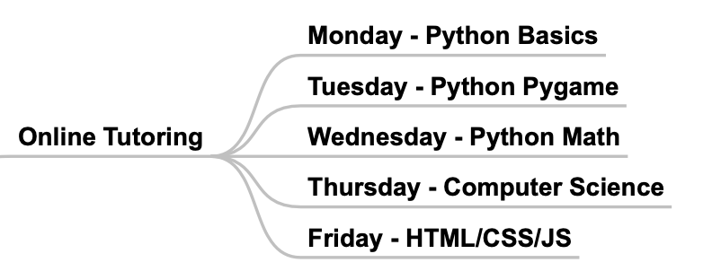

# Happy Coding Kids

## Levels
* Interest：iMovie，Keynote, Scratch, Wix
* Beginner：Python, PyGame, Turtle, JavaScript, Roblox
* Advanced：OOP, Algorithms, Games
* Expert: Data Analysis, Algorithm Trading

## Schedule

### Beginner Courses
  

## Prerequisites
* [Laptop](https://www.amazon.ca/s/gp/search/ref=sr_nr_p_89_5?fst=as%3Aoff&rh=n%3A667823011%2Cn%3A2404990011%2Cn%3A677252011%2Ck%3Alaptop%2Cp_36%3A12035764011%2Cp_n_feature_five_browse-bin%3A7326865011%7C7326866011&keywords=laptop&ie=UTF8&qid=1546931643)(Mac or Windows) with Web Cam and Microphone
* [Scratch](https://scratch.mit.edu/) registration for blocks coding
* [Wix](https://www.wix.com) registration for website building
* [Anaconda](https://www.anaconda.com/download/#macos) download for Python coding

## Good to know
- [Github](https://www.youtube.com/watch?v=w3jLJU7DT5E)
- [Markdown](https://www.youtube.com/watch?v=6A5EpqqDOdk&t=263s)
- [VSCode](https://code.visualstudio.com/download)

## Starting Projects
- Youtube Videos
- Ecommerce Websites
- Scratch Games
- Python Turtle Drawings
- Python Pygame Games
- Python Financial Data Analysis
- Python Algorithm Trading

## Courses Design

### Interest

**iMovie - Create videos for Youtube**
* Lesson 1:
    * Explore the use of desktop movies as a learning tool. 
    * Storyboarding 
    * Learn to operate digital camera  
    * Sign-up for camera use  
    * Overview of iMovie  
    * Assignment for next class: read information about editing and complete storyboards.
* Lesson 2:
    * Copyright issues
    * Review storyboards  
    * Sign-up for camera use  
    * Gather clips from digital cameras  
    * Learn to use iMovie software to edit clips, including titles and transitions 
    * Background music -- from CD, download,  or create your own 
* Lesson 3:
    * Export completed movies to files or Youtube
    * Add special effects to video 
    * Continue working on iMovie projects  
* Lesson 4:
    * Continue working on iMovie projects  
    * Review finished projects  

**Keynote - Create prototype for business ideas**
* Lesson 1：Simple Prototyping
* Lesson 2：Animation Effects
* Lesson 3：Events
* Lesson 4：Review Projects

**Wix**
* Lesson 1：Introduct Internet and Create simple website
* Lesson 2: Enhance website with components
* Lesson 3: Publish website and link to domain name
* Lesson 4: Learn html, css, and javascript

**Scratch Courses**

* 	[Square](https://www.youtube.com/watch?v=EbBbWfvbMiU)
* 	[Polygons](https://www.youtube.com/watch?v=KFwgPVjMjak)
*  	[Shooting game](https://www.youtube.com/watch?v=QXru0rSV2ZQ&t=575s) 
* 	[Flappy bird game](https://www.youtube.com/watch?v=V11A1iqQ_V8&list=PLBm8I171dvlyKvrTADogMruDbZ-oZ8ZFm)
* 	[Haunting adventure game]() 
* 	[Street Fighter game]() 

### Beginner

* [Learning to Code with Python](https://www.youtube.com/playlist?list=PLsk-HSGFjnaGe7sS_4VpZoEtZF2VoWtoR)
* [Let's Learn Python: Basics](https://www.youtube.com/playlist?list=PL82YdDfxhWsDJTq5f0Ae7M7yGcA26wevJ)

### Advanced

* [Python OOP Tutorials - Working with Classes](https://www.youtube.com/playlist?list=PL-osiE80TeTsqhIuOqKhwlXsIBIdSeYtc)
* [Game Development with Pygame](https://www.youtube.com/playlist?list=PLsk-HSGFjnaH5yghzu7PcOzm9NhsW0Urw)
* [Data Structure](https://www.raspberrypi.org/learning/visualising-sorting-with-python/lessons/)
* [Algorithms](http://interactivepython.org )

---

## [Canadian Computing Competition](http://www.cemc.uwaterloo.ca/contests/computing/details.html)

The Canadian Computing Competition (CCC) is a fun challenge for secondary school students with an interest in programming. It is an opportunity for students to test their ability in designing, understanding and implementing algorithms.

加拿大计算机竞赛（Canadian Computing Competition，简称CCC）是加拿大面向中学生每年举办一次的计算机程序设计比赛，比赛的目的是为大中学生朋友们提供一个机会来测试自己分析、设计以及编程实现算法的能力。

加拿大全国中学生计算机竞赛(Canadian Computing Competition) 是由Waterloo 大学计算机系与加拿大数学与计算机教育中心联合举办的全加计算机竞赛, 简称CCC竞赛. 至今已举办了11届. 该竞赛的目的有两个, 一是给中学生一个机会以发展他们的计算机编程和算法设计能力, 另一个目的就是选拔选手组成加拿大代表队参加当年的国际奥林匹克计算机竞赛. CCC一般每年二月份开始举行第一阶段竞赛.

每一届的CCC竞赛均分为两个阶段. 第一阶段, 即初赛阶段, 在各报名选手所在的学校举行. 初赛阶段有分JUNIOR组和SENIOR组. JUNIOR组的学生限定与在学校只修过一个学分的计算机课程, 并不限定与学生所在的年级.其他人则只能参加SENIOR组. 同时, 根据这边的鼓励早出人才的一贯政策, 任何学生均可参加SENIOR组. 第二阶段, 相当于决赛阶段, 在Waterloo 大学举行, 进行两天. 在第一阶段的SENIOR组的前25名选手才有资格进入第二阶段. 而加拿大参加国际奥林匹克计算机竞赛的代表队便由第二阶段产生.
